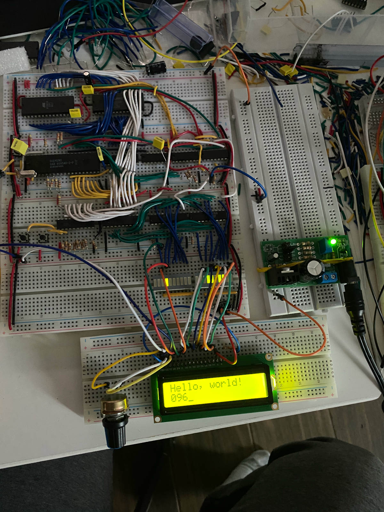

## Mikrus-85 - a breadboard 8085 computer

See my blog post (in Polish) for details: [blog](https://marcin-chwedczuk.github.io/minikomputer-8085-czesc-I).

For English only readers:

I based my work on: https://www.nutsvolts.com/magazine/article/build-a-pocket-sized-altair-computer

SmallC compiler is taken from: https://github.com/ncb85/SmallC-85

This is still work in progress.

